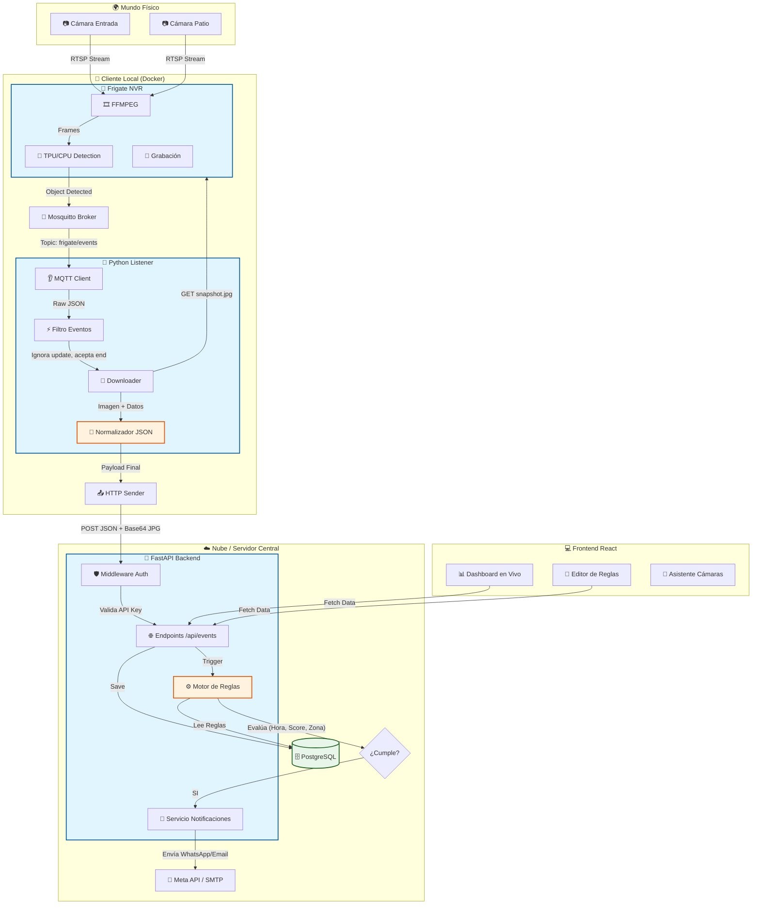

# Arquitectura del Sistema Vidria

Este diagrama explica el flujo de datos desde la cámara física hasta la interfaz de usuario.

# Arquitectura del Sistema Vidria (Detallada)

Diagrama técnico de componentes, flujos de datos y servicios.

## Diccionario de Datos

| Componente | Función Principal | Tecnología |
| :--- | :--- | :--- |
| **Frigate** | Procesa el video crudo y detecta objetos usando IA. | C++, Python, TensorFlow |
| **MQTT** | "Tubería" de mensajería instantánea local. | Protocolo MQTT |
| **Listener** | Agente que "pega" el mundo local con la nube. Añade contexto (ID Cliente). | Python |
| **Backend** | Cerebro central. Recibe, guarda y decide si alertar. | Python (FastAPI) |
| **Motor de Reglas** | Lógica de negocio personalizable ("Si veo X con confianza Y, avisa"). | Python |

