# Arquitectura del Sistema Vidria

Este diagrama explica el flujo de datos desde la cámara física hasta la interfaz de usuario.

# Arquitectura del Sistema Vidria (Detallada)

Diagrama técnico de componentes, flujos de datos y servicios.

```mermaid
graph TD
    %% --- CAPA FÍSICA ---
    subgraph Physical ["🌍 Mundo Físico"]
        Cam1[📷 Cámara Entrada]
        Cam2[📷 Cámara Patio]
    end

    %% --- CAPA EDGE (Cliente) ---
    subgraph Edge ["🏢 Cliente Local (Docker)"]
        
        subgraph Frigate_Container ["🐳 Frigate NVR"]
            Decoder[🎞️ FFMPEG]
            Detector[🧠 TPU/CPU Detection]
            Recorder[💾 Grabación]
        end

        MQTT[📡 Mosquitto Broker]
        
        subgraph Listener_Container ["🐍 Python Listener"]
            MqttClient[👂 MQTT Client]
            EventFilter[⚡ Filtro Eventos]
            ImgDownloader[📸 Downloader]
            Normalizer[🔄 Normalizador JSON]
        end

        %% Flujos Edge
        Cam1 & Cam2 -->|RTSP Stream| Decoder
        Decoder -->|Frames| Detector
        Detector -->|Object Detected| MQTT
        MQTT -->|Topic: frigate/events| MqttClient
        
        MqttClient -->|Raw JSON| EventFilter
        EventFilter -->|Ignora update, acepta end| ImgDownloader
        ImgDownloader -->|GET snapshot.jpg| Frigate_Container
        ImgDownloader -->|Imagen + Datos| Normalizer
        Normalizer -->|Payload Final| Sender[📤 HTTP Sender]
    end

    %% --- CAPA NUBE / BACKEND ---
    subgraph Cloud ["☁️ Nube / Servidor Central"]
        
        subgraph Backend_App ["🚀 FastAPI Backend"]
            API[🌐 Endpoints /api/events]
            Auth[🛡️ Middleware Auth]
            RuleEng[⚙️ Motor de Reglas]
            Notify[🔔 Servicio Notificaciones]
        end
        
        DB[(🗄️ PostgreSQL)]

        %% Flujos Cloud
        Sender -->|POST JSON + Base64 JPG| Auth
        Auth -->|Valida API Key| API
        API -->|Save| DB
        API -->|Trigger| RuleEng
        
        RuleEng -->|Lee Reglas| DB
        RuleEng -->|"Evalúa (Hora, Score, Zona)"| RuleLogic{"¿Cumple?"}
        RuleLogic -->|SI| Notify
        Notify -->|"Envía WhatsApp/Email"| External[📱 Meta API / SMTP]
    end

    %% --- CAPA USUARIO ---
    subgraph UserInterface ["💻 Frontend React"]
        Dashboard[📊 Dashboard en Vivo]
        RulesPanel[📝 Editor de Reglas]
        CamWizard[🧙 Asistente Cámaras]
        
        Dashboard & RulesPanel -->|Fetch Data| API
    end

    %% Estilizado
    classDef docker fill:#e1f5fe,stroke:#01579b,stroke-width:2px;
    classDef python fill:#fff3e0,stroke:#e65100,stroke-width:2px;
    classDef db fill:#e8f5e9,stroke:#1b5e20,stroke-width:2px;
    
    class Frigate_Container,Listener_Container,Backend_App docker;
    class RuleEng,Normalizer python;
    class DB db;
```

## Diccionario de Datos

| Componente | Función Principal | Tecnología |
| :--- | :--- | :--- |
| **Frigate** | Procesa el video crudo y detecta objetos usando IA. | C++, Python, TensorFlow |
| **MQTT** | "Tubería" de mensajería instantánea local. | Protocolo MQTT |
| **Listener** | Agente que "pega" el mundo local con la nube. Añade contexto (ID Cliente). | Python |
| **Backend** | Cerebro central. Recibe, guarda y decide si alertar. | Python (FastAPI) |
| **Motor de Reglas** | Lógica de negocio personalizable ("Si veo X con confianza Y, avisa"). | Python |

